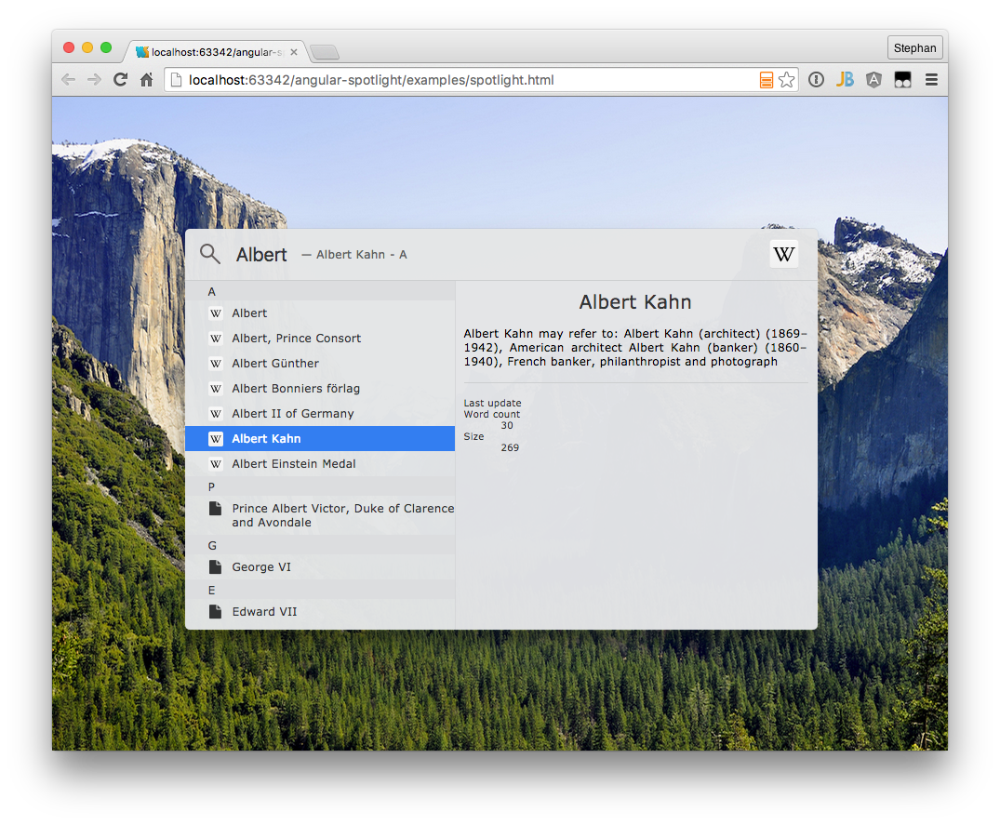
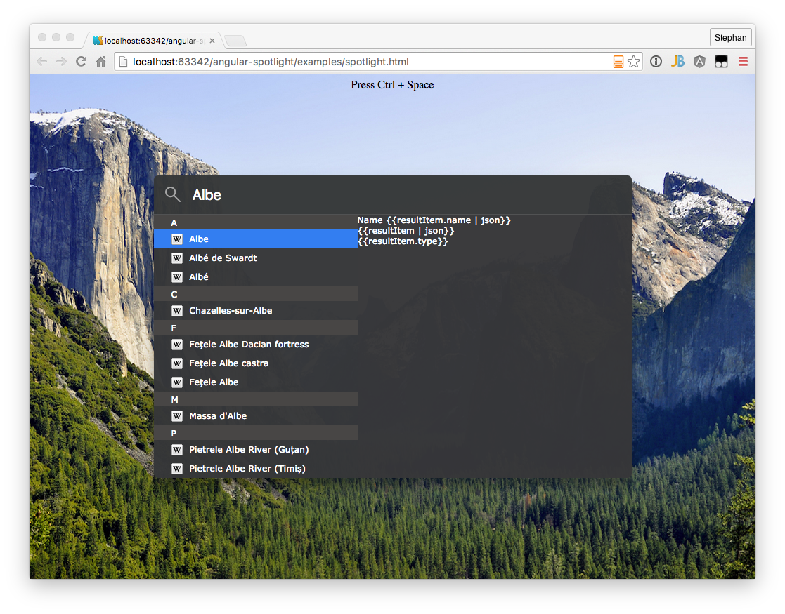
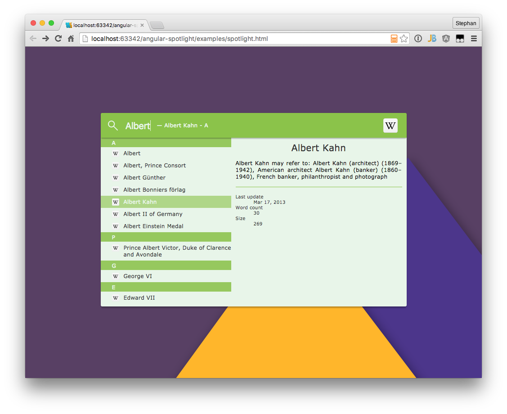

# Angular Spotlight 

[](https://travis-ci.org/code-arcs/angular-spotlight)
[](https://david-dm.org/SteKoe/angular-spotlight)
[](http://www.apache.org/licenses/LICENSE-2.0.html)

Spotlight is _the_ awesome search feature of Mac OS X.
Now it is time to move this piece of software into the web area.

## Running Example
To see a working example of this angular tool, have a look at: http://cdn.rawgit.com/SteKoe/angular-spotlight/master/examples/. The example implements two search sources: One using Github-Search-API, the other one using Wikipedia (EN) Search API. 

## Data Source Structure
The final result of this project is to have an angular directive which consumes a list of result items coming from any search service one can imagine (Lucene, Elastic Search, ...).
The preliminary JSON format which is consumed by the directive is as follows:

```js
[
  {
    "name": "I am a category",
    "items": [
        {
            "name": "First result in category", // Will be shown in the results list panel
            "type": "your-custom-type", // Will be used to load custom icons / templates in the result item detail panel
            "href": "http://...", // Link which will be triggered when user double clicks on result item or uses enter key
            "description": "Whatever description", // Additional attriutes which can be accessed in custom result item detail panel
            ...
        },
        ...
    ]
  },
  {
    ...
  }
  ...
]
```

The current implementation takes name and items attributes to create the result list as seen in the theming section below.

## Custom Templates / Result Types
Angular Spotlight implements a very basic result panel template which just shows a standard icon and the name of the selected element.
In order to extend and add custom types and templates or override the default one, Angular Spotlight offers an interface to manipulate the default behavior.
The result panel checks depending on the ```type``` field in the JSON response which template and icon to use.

The following listing shows how to add custom icons to the Spotlight Directive.
Just use the ```addIcons()``` function offered by ```AngularSpotlightProvider``` inside the configuration phase of your angular application.
The ```AngularSpotlightProvider``` consumes a JSON object having a key-value pair. 
The key has to fit the ```type``` field in your JSON response whereas the value contains the icon.
Angular Spotlight currently supports urls including data urls as well as css classes.
Check the example below.
Any result of type wikipedia will have an svg image icon specified by a data url.
vCards will show a standard user icon by using FontAwesome icon css classes.

```javascript
AngularSpotlightProvider.addIcons({
    'wikipedia': 'data:image/svg+xml;utf8,<svg> ... </svg>',
    'vcard':     'fa fa-user'
});
```

If you want to customize the template of the result panel as well, use the ```addTemplates``` function of ```AngularSpotlightProvider```.
The function also takes an JSON object having a key-value pair.
The key again addresses the type and the value a HTML template which will be shown, when an item having the corresponding type is selected in the results list.
You can either use inline HTML or specify a HTML template file path.

```javascript
AngularSpotlightProvider.addTemplates({
    'wikipedia': 'templates/wikipedia.html',
    'vcard':      '<div class="ng-spotlight-results-detail-vcard">\
                       <div class="profile-image"><span class="fa fa-user"></span></div>\
                       <ul>\
                           <li class="name">{{selectedItem.name}}</li>\
                               <li ng-if="selectedItem.phone"><span class="fa fa-phone"></span> {{selectedItem.phone}}</li>\
                               <li ng-if="selectedItem.email"><span class="fa fa-envelope"></span> {{selectedItem.email}}</li>\
                               <li ng-if="selectedItem.fax"><span class="fa fa-print"></span> {{selectedItem.fax}}</li>\
                               <li ng-if="selectedItem.www"><span class="fa fa-globe"></span> <a href="#" ng-href="{{selectedItem.www}}" target="_blank">{{selectedItem.www}}</a></li>\
                       </ul>\
                   </div>'
});
```


## Themes
Angular Spotlight currently includes three themes: Dark, Light and Material Design. 
This is - of course - due to the dark and light themes available on Mac OS.
Thanks to Lukas @Pandaros for adding the light theme as well as the Material Design theme - much appreciated! :)





## Third Party Libs
 * We adopted the behavior, look and feel from Apple's Spotlight from Mac OS. All rights regarding the design, concept and of course the name "Spotlight" are Trademark of Apple Inc. 
 * Implements InputGrow Feature implemented by James Padolsey
 * Background of Material Design Theme is taken from Google's Material Design Guide ([1](https://plus.google.com/photos/+BrianParkerson/albums/6079410227152958097/6079410228948829362?pid=6079410228948829362&oid=110417708449272621219))
 * Background image which is used to illustrate to transparency for dark and light themes is taken from apfellike.com

## License
Copyright 2015 Stephan Köninger

Licensed under the Apache License, Version 2.0 (the "License");
you may not use this file except in compliance with the License.
You may obtain a copy of the License at

    http://www.apache.org/licenses/LICENSE-2.0

Unless required by applicable law or agreed to in writing, software
distributed under the License is distributed on an "AS IS" BASIS,
WITHOUT WARRANTIES OR CONDITIONS OF ANY KIND, either express or implied.
See the License for the specific language governing permissions and
limitations under the License.
