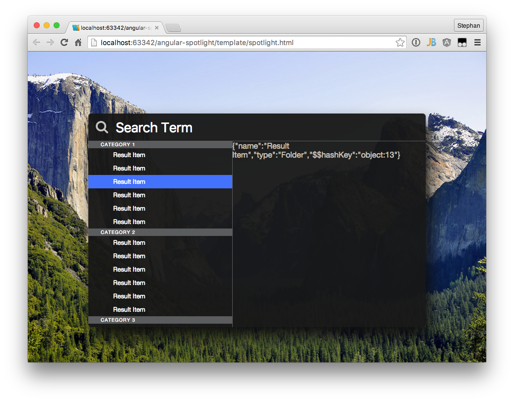

# Angular Spotlight

I liked Spotlight ever since I started to use a Mac. 
Now it is time to move this awesome pice of software into the web area.
The first result can be seen below.

The final result of this project is to have an angular directive which consumes a list of result items coming from any search service one can imagine (Lucene, Elastic Search, ...).
The preliminary JSON format is as follows:

```
[
  {
    name: "I am a category",
    items: [
    	{
    		name: "First result in category",
    		type: "Whatever",
    		description: "Whatever description",
    		...
    	},
    	...
    ]
  },
  ...
]
```

The current implementation takes name and items attributes to create the result list as seen in the picture below.

All rights regarding the design, concept and of course the name "Spotlight" are probably Trademarks of Apple Inc. 
The background image which is used to illustrate to transparency is taken from apfellike.com.


